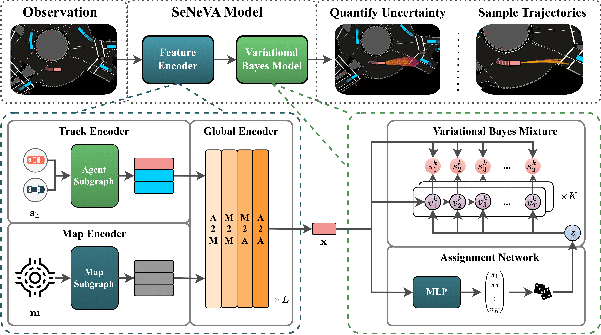
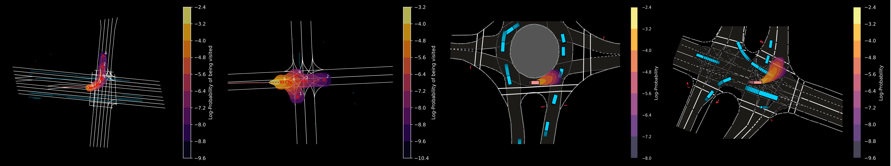

<!-- markdownlint-disable -->

# Quantifying Uncertainty in Motion Prediction with Variational Bayesian Mixture

<div align="center">
<a href="https://www.python.org/downloads/"></a>
<a href="https://pytorch.org/get-started/locally/"></a>
<a href="https://pytorchlightning.ai/"></a>
<a href="https://hydra.cc/"></a>
<a href="https://github.com/PurdueDigitalTwin/seneva"></a>
<a href="https://github.com/PurdueDigitalTwin/seneva/blob/master/LICENSE"></a><br>
</div>

This repository contains the official implementation of the CVPR 2024 paper ["Quantifying Uncertainty in Motion Prediction with Variational Bayesian Mixture"](https://openaccess.thecvf.com/content/CVPR2024/html/Lu_Quantifying_Uncertainty_in_Motion_Prediction_with_Variational_Bayesian_Mixture_CVPR_2024_paper.html).

Authors: Juanwu Lu, Can Cui, Yunsheng Ma, Aniket Bera, Ziran Wang



## Abstract

Safety and robustness are crucial factors in developing trustworthy autonomous vehicles. One essential aspect of addressing these factors is to equip vehicles with the capability to predict future trajectories for all moving objects in the surroundings and quantify prediction uncertainties. In this paper we propose the Sequential Neural Variational Agent (SeNeVA) a generative model that describes the distribution of future trajectories for a single moving object. Our approach can distinguish Out-of-Distribution data while quantifying uncertainty and achieving competitive performance compared to state-of-the-art methods on the Argoverse 2 and INTERACTION datasets. Specifically a 0.446 meters minimum Final Displacement Error a 0.203 meters minimum Average Displacement Error and a 5.35% Miss Rate are achieved on the INTERACTION test set. Extensive qualitative and quantitative analysis is also provided to evaluate the proposed model.

## Getting Started

### Prepare Environment

The implementation of SeNeVA requires **Python 3.10**, **PyTorch 2.3** and **Lightning 2.3**. If you are using Anaconda/Miniconda environment, you can create the virtual environment by running the following line inside the root directory:

```bash
$ conda env create -f environment.yaml
```

If you prefer a Docker® container, we provide `dockerfile` in the root directory. Inside the virtual environment, you can install the requirements and SeNeVA project by running the following lines

```bash
# For conda environment only
$ conda activate seneva
# Change to project root directory and install python package
$ cd seneva/
$ pip install .
```

Now you are good to go! By default, you can run `train-seneva` in your shell environment to kick off training.

### Prepare Dataset

Download the [Argoverse 2](https://www.argoverse.org/av2.html#forecasting-link) and [INTERACTION](https://interaction-dataset.com/) datasets from the official websites and place the data files under the `data` folder below root directory. Your data folder should be like the following:

```plain
data/
├── av2
│   └── raw
│       ├── test
│       ├── train
│       └── val
└── interaction
    ├── processed
    └── raw
        ├── maps
        ├── test_conditional-multi-agent
        ├── test_conditional-single-agent
        ├── test_multi-agent
        ├── test_single-agent
        ├── train
        ├── trainval
        └── val
```

This allows the datamodules to directly access the dataset by default. However, you may also change the directory to the dataset folders during runtime by passing the arguments. For example, you can run the following line by passing the root directory of the Argoverse 2 dataset.

```bash
$ train-seneva experiment=argoverse/baseline data.root=<path-to-av2-dataset>
```

For more details, please refer to the [Hydra Documentation](https://hydra.cc/docs/intro/).

## Examples



## Citation

If you find our work helpful for your project, please cite

```bibtex
@InProceedings{Lu_2024_CVPR,
    author = {Lu, Juanwu and Cui, Can and Ma, Yunsheng and Bera, Aniket and Wang, Ziran},
    title  = {Quantifying Uncertainty in Motion Prediction with Variational Bayesian Mixture},
    booktitle = {Proceedings of the IEEE/CVF Conference on Computer Vision and Pattern Recognition (CVPR)},
    month = {June},
    year  = {2024},
    pages = {15428-15437}
}

@misc{lu2024quantifyinguncertaintymotionprediction,
      title={Quantifying Uncertainty in Motion Prediction with Variational Bayesian Mixture}, 
      author={Juanwu Lu and Can Cui and Yunsheng Ma and Aniket Bera and Ziran Wang},
      year={2024},
      eprint={2404.03789},
      archivePrefix={arXiv},
      primaryClass={cs.CV},
      url={https://arxiv.org/abs/2404.03789}, 
}
```

## License

This implementation of SeNeVA is licensed under the MIT license. See `LICENSE` for details.
